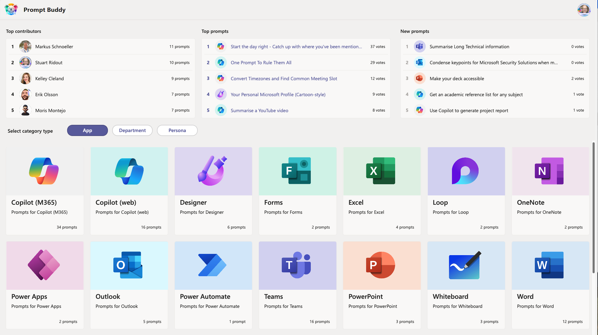
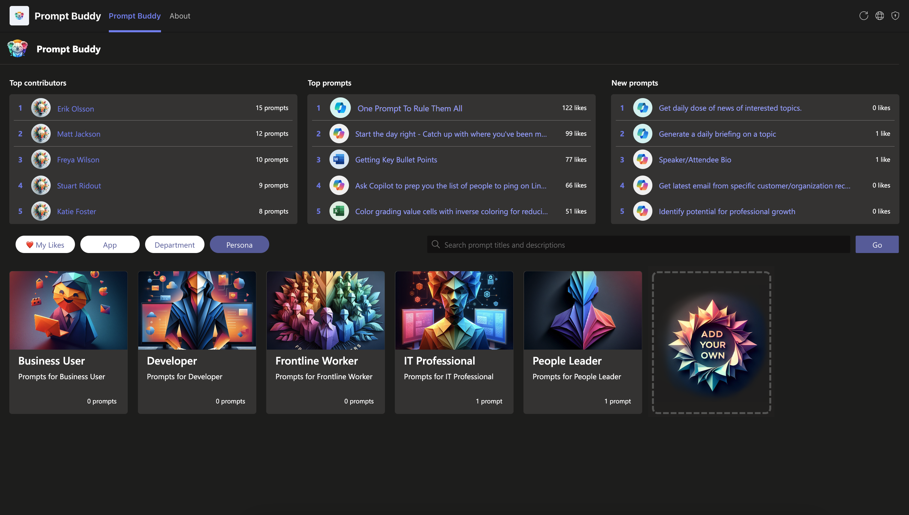

##  Overview
### Welcome to the official page for Prompt Buddy! 
With the Prompt Buddy app, you get a space in Microsoft Teams where your team (or even your entire organization) can share and discover their favourite AI prompts.  The app is preloaded with Microsoft Copilot, and other categories, but you can add your own if you've developed your own AI apps that people are using.

It's really easy to use and by giving your favourite prompts a ❤️, it raises the most impactful prompts to the top of the leaderboard!

It supports dark mode 🖤 and offers a mobile layout when using Teams on your phone📲. 

Prompt Buddy is a Teams application built on the Power Platform. 

Once installed, it can be [customized and extended](https://docs.microsoft.com/en-us/powerapps/teams/customize-sample-apps) by the installer of the application. 

## Installing
It's easy! Just click the below link to view our short video tutorial for **Install (6 min) & Demo (8 min)** as an admin.

Follow the steps and Prompt Buddy installs as an unmanaged solution in your environment for Microsoft Teams.
# [**▶️Video: Install (6 min) & Demo (8 min)📺**](https://aka.ms/PromptBuddyVideo)

**_Recommended_: Install in Teams**

**This is the easiest and quickest method to get started with this app template.** The provisioning is fully automated once the process starts and may take upto 2-3 minutes. You will get the option to chose which team in Teams you'd like to install this app in. 

If this is the first Power App in the team, a new Dataverse for Teams environment will be provisioned, the app installed, automatically shared with all members of the team and tabbed to the channel you select. You will be able to [edit the app](https://docs.microsoft.com/en-us/powerapps/teams/customize-sample-apps) after installation by opening to the Power Apps app in Teams.

Note that this provisions the 'unmanaged' solution in your Teams environment. As noted below, this means that you can take advantage of any future updates being made to the app by updating the application (follow same steps as original installation).

You'll find more information on features and adoption tips in the [Solution Overview](Documentation/images/Solution%20Overview%20-%20Prompt%20Buddy%20(Public%20version).pdf).

## Updating
**Smooth Updates**

If/When you import a new release of Prompt Buddy into the same environment, it updates any existing installation while keeping all your settings and prompts intact. Just follow the video again. Now that's smoooooth.

Good to know: 

New releases can contain new or improved sample prompts (view changelog for details). If you already imported sample prompts from a previous release, we recommend that you edit the JSON script to only include new ones to avoid duplicates.
Should you happen to be reading this _after_ importing the same sample prompts twice (whoops), simply visit each category from the manager tab to delete any duplicates. 

## FAQ
#### _"We use Microsoft Copilot Lab. Do we really need a Prompt Buddy?"_ - [Yes, they're Better Together! - View full answer](https://github.com/stuartridout/promptbuddy/issues/2#issuecomment-2034184541)
###### _"Simple link to share this page with a friend?"_ - [aka.ms/GetPromptBuddy](https://aka.ms/GetPromptBuddy)
###### _"I'm a Microsoft employee. Where can I access the internal version?"_ - [aka.ms/PromptBuddy](https://aka.ms/PromptBuddy) _"-Ok, but how can I add it in Teams?"_ [aka.ms/PromptBuddy/Teams](https://aka.ms/PromptBuddy/Teams)

**We hope you enjoy Prompt Buddy!**

**/Stuart & Erik**

## Trademarks

This project may contain trademarks or logos for projects, products, or services. Authorized use of Microsoft 
trademarks or logos is subject to and must follow 
[Microsoft's Trademark & Brand Guidelines](https://www.microsoft.com/en-us/legal/intellectualproperty/trademarks/usage/general).
Use of Microsoft trademarks or logos in modified versions of this project must not cause confusion or imply Microsoft sponsorship.
Any use of third-party trademarks or logos are subject to those third-party's policies.

## 
